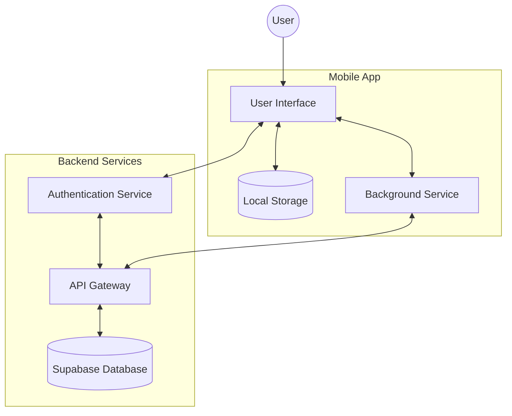
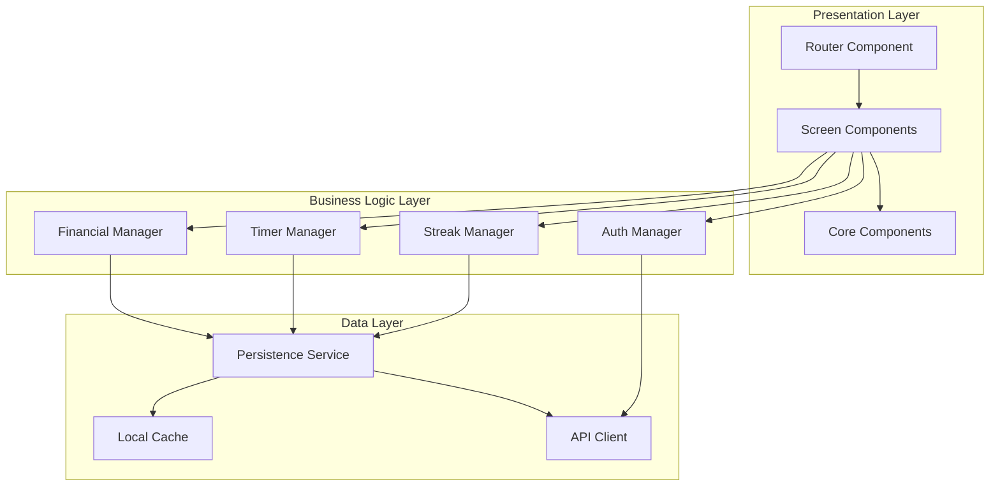
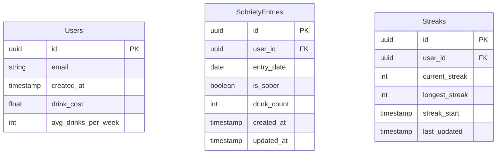

# System Architecture Document (SAD)

## 1. Overview
### Purpose
Zero Proof is a mobile application designed to help individuals track and maintain their sobriety journey. The system provides real-time tracking of sobriety streaks, financial savings calculations, and visual progress representation through an interactive calendar interface. The primary users are individuals working to reduce or eliminate alcohol consumption who need a data-driven accountability tool.

### Scope
Included:
- User authentication and account management
- Real-time sobriety tracking and streak calculation
- Financial savings tracking and calculations
- Interactive calendar visualization
- Background timer processing
- Data persistence and synchronization
- Progress sharing capabilities

Out of scope:
- Social networking features
- Direct communication between users
- Integration with external health tracking systems
- Professional medical or counseling services

### Context
The system operates as a mobile application within the following constraints:
- Must function offline with local data storage
- Requires secure handling of sensitive personal health data
- Needs to maintain accurate timing even when the app is in the background
- Must provide real-time updates and immediate user feedback
- Should optimize battery usage while maintaining background processes

---

## 2. Architectural Goals
- **Performance**: Fast local operations with efficient background syncing
- **Reliability**: Consistent data persistence and accurate timing calculations
- **Security**: Secure storage of user data and authenticated access
- **Scalability**: Support for growing user base and data storage needs
- **Maintainability**: Modular design with clear separation of concerns
- **Offline Functionality**: Core features available without internet connection
- **Battery Efficiency**: Optimized background processes
- **User Privacy**: Protected personal health information

---

## 3. System Context Diagram


### Description
- **User Interface**: React Native components for user interaction
- **Local Storage**: AsyncStorage and SecureStore for offline data
- **Background Service**: Manages timer and notifications
- **Authentication Service**: Handles user authentication via Supabase
- **API Gateway**: Manages data flow between app and database
- **Database**: Supabase backend for data persistence

---

## 4. Component Diagrams
### High-Level Architecture


### Subsystems & Modules
1. **Presentation Layer**
   - Router: Expo Router for navigation
   - Screens: Main views (Dashboard, Calendar, Settings)
   - Core Components: Reusable UI elements

2. **Business Logic Layer**
   - Auth Manager: User authentication and session management
   - Streak Manager: Sobriety streak calculations and updates
   - Timer Manager: Background timer processing
   - Financial Manager: Savings calculations and tracking

3. **Data Layer**
   - Local Cache: AsyncStorage for offline data
   - API Client: Supabase client integration
   - Persistence Service: Data synchronization logic

---

## 5. Data Models
### Database Schema


### Data Flow
1. **User Authentication Flow**
   - Local credentials → Auth Manager → Supabase Auth → JWT Token
   - Token stored in SecureStore

2. **Sobriety Entry Flow**
   - User Input → Local Cache → Background Sync → Supabase
   - Triggers streak recalculation
   - Updates financial savings

3. **Timer Update Flow**
   - Background Service → Local Cache → UI Update
   - Periodic sync with server

---

## 6. Interface Definitions
### APIs
1. **Authentication API**
   ```typescript
   interface AuthAPI {
     signUp(email: string, password: string): Promise<User>;
     signIn(email: string, password: string): Promise<Session>;
     signOut(): Promise<void>;
     resetPassword(email: string): Promise<void>;
   }
   ```

2. **Sobriety API**
   ```typescript
   interface SobrietyAPI {
     markDay(date: Date, isSober: boolean, drinkCount?: number): Promise<void>;
     getEntries(startDate: Date, endDate: Date): Promise<SobrietyEntry[]>;
     updateEntry(entry: SobrietyEntry): Promise<void>;
   }
   ```

### Data Contracts
1. **User Profile**
   ```typescript
   interface UserProfile {
     id: string;
     email: string;
     drinkCost: number;
     avgDrinksPerWeek: number;
     created_at: Date;
   }
   ```

2. **Sobriety Entry**
   ```typescript
   interface SobrietyEntry {
     id: string;
     userId: string;
     date: Date;
     isSober: boolean;
     drinkCount?: number;
     created_at: Date;
     updated_at: Date;
   }
   ```

---

## 7. Technology Stack
### Programming Languages & Frameworks
- **Frontend**
  - React Native: Cross-platform mobile development
  - Expo: Development and deployment framework
  - TypeScript: Type-safe development
  - TailwindCSS/NativeWind: Styling
  - React Hook Form: Form management
  - Zod: Schema validation

- **Backend**
  - Supabase: Backend-as-a-Service
  - PostgreSQL: Database
  - Row Level Security: Data protection

### Infrastructure & Deployment
- **Development**
  - Expo CLI: Development tooling
  - ESLint & Prettier: Code quality
  - Git: Version control

- **Production**
  - Expo Application Services: App deployment
  - Supabase Cloud: Backend hosting
  - Automated CI/CD pipeline

---

## 8. Risk & Mitigation
### Risk Assessment
1. **Data Loss**
   - Impact: High
   - Probability: Low
   - Risk: Loss of user progress and trust

2. **Privacy Breach**
   - Impact: High
   - Probability: Low
   - Risk: Exposure of sensitive health data

3. **Sync Conflicts**
   - Impact: Medium
   - Probability: Medium
   - Risk: Inconsistent user data

4. **Battery Drain**
   - Impact: Medium
   - Probability: Medium
   - Risk: Poor user experience

### Mitigation Strategies
1. **Data Loss Prevention**
   - Regular data backups
   - Multi-layer persistence strategy
   - Conflict resolution protocols

2. **Privacy Protection**
   - End-to-end encryption
   - Secure storage practices
   - Regular security audits

3. **Sync Management**
   - Optimistic updates
   - Conflict resolution strategy
   - Retry mechanisms with exponential backoff

4. **Battery Optimization**
   - Efficient background processing
   - Batch synchronization
   - Configurable update intervals

---

## 9. Appendix
### Glossary
- **Streak**: Consecutive days of sobriety
- **Entry**: Daily sobriety status record
- **Timer**: Real-time sobriety duration tracker
- **Savings**: Calculated financial benefits based on user drink costs

### References
- React Native Documentation
- Expo Documentation
- Supabase Documentation
- TypeScript Best Practices
