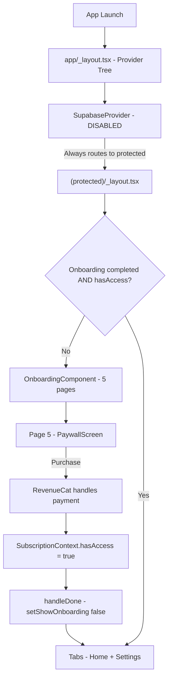
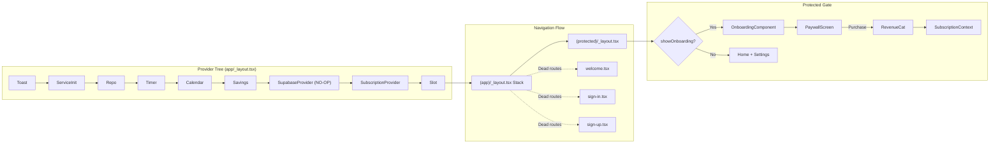

## Disable Supabase Authentication - Simplify Onboarding Entry

<!--
- THIS IS YOUR SOURCE OF TRUTH.
- USE IT TO TAKE ANY NOTES YOU MAY FIND HELPFUL.
- AS YOU COMPLETE THE TASK, UPDATE THIS CHECKLIST TO REFLECT PROGRESS. (- [x] for done, - [ ] for pending)
-->

### Executive Summary

#### What's broken?

Supabase authentication forces new users through a sign-up/sign-in wall before reaching the onboarding experience, adding friction and causing bugs.

#### What's the fix?

Disable (comment out) all Supabase auth code so users go directly from app launch into the onboarding swiper and paywall flow.

#### What happens after the fix?

- **New user**: Opens app -> sees onboarding page 1 (Sobriety Heatmap) -> swipes through all 5 pages -> hits paywall -> purchases -> enters app
- **Existing user with subscription**: Opens app -> goes directly to main Home screen (no auth prompt, no onboarding)
- **Existing user without subscription**: Opens app -> sees onboarding/paywall flow until they subscribe

#### What changes?

- `config/supabase.ts`: Client init commented out, exports `supabase = null` and `isSupabaseAvailable = false`
- `context/supabase-provider.tsx`: Auth logic commented out, always routes to `/(app)/(protected)` (no-op passthrough)
- `app/(app)/(protected)/settings.tsx`: Sign-out button and email display removed
- `lib/services/EmailVerificationService.ts`: Supabase calls commented out, methods return no-op
- `lib/services/DeepLinkService.ts`: Supabase URL fragment handling commented out
- `package.json`: `@testing-library/react-hooks` removed (peer dep fix)
- 2 test files: Import path swapped from `@testing-library/react-hooks` to `@testing-library/react-native`
- 3 test files: Supabase mocks simplified/removed

#### What's the risk?

- **Low risk**: All Supabase code is commented out (not deleted) for future re-enablement
- **Protected**: Hard paywall gate in `(protected)/_layout.tsx` is untouched -- subscription revenue flow preserved
- **Protected**: RevenueCat integration is completely independent of Supabase
- **Protected**: All local data (sobriety tracking, calendar, timer, savings) is unaffected
- **Fallback**: Uncomment the Supabase code blocks to restore auth

#### What's on me?

- [ ] Verify `npm install` succeeds on fresh machine after changes
- [ ] Test on iOS Simulator: new user flow (onboarding -> paywall)
- [ ] Test on iOS Simulator: returning user with subscription (straight to Home)
- [ ] Confirm no regressions in subscription/paywall behavior

---

### Description

The Zero Proof app currently requires Supabase authentication (sign-up/sign-in with email verification) before users can access the onboarding experience. This adds unnecessary friction for new users and has caused bugs. Since the app has no active users with accounts and all data is stored locally on device, authentication can be safely disabled.

The fix disables (comments out) all Supabase auth code while preserving it in the codebase for potential future re-enablement. The existing subscription gate (RevenueCat paywall in the onboarding flow) remains as the primary access control mechanism.

Additionally, this resolves a `npm install` peer dependency conflict caused by `@testing-library/react-hooks` (deprecated, merged into `@testing-library/react-native@^13.2.0`).

### Current vs Target State Comparison

| Scenario            | Current                                                                          | Target                                                                |
| ------------------- | -------------------------------------------------------------------------------- | --------------------------------------------------------------------- |
| **User Experience** | App launch -> Welcome screen -> Sign Up -> Email verify -> Sign In -> Onboarding | App launch -> Onboarding page 1 -> Swipe through -> Paywall -> App    |
| **Code Structure**  | `SupabaseProvider` manages auth state + navigation guard                         | `SupabaseProvider` is a no-op passthrough, always routes to protected |
| **Data Flow**       | Supabase session check determines routing                                        | Direct routing to `/(app)/(protected)`, subscription gate handles access |
| **Performance**     | Network call to Supabase on every app launch                                     | No network call for auth, faster cold start                           |
| **Dependencies**    | `@supabase/supabase-js` active, `@testing-library/react-hooks` causes peer conflict | Supabase package stays but unused, peer dep conflict resolved         |
| **Error Handling**  | Missing Supabase env vars cause warnings                                         | No Supabase env vars needed, no warnings                             |

### Acceptance Criteria

- [ ] `npm install` completes successfully without `--legacy-peer-deps` flag on a fresh machine with no `~/.npmrc`
- [ ] New user launching app for the first time sees onboarding page 1 ("Sobriety Heatmap"), NOT the welcome/sign-in screen
- [ ] New user can swipe through all 5 onboarding pages in order: Heatmap -> Streak -> Savings -> Drink Quantity -> Paywall
- [ ] Paywall on page 5 blocks access to the main app until subscription/trial is purchased (hard gate preserved)
- [ ] Existing user with active subscription bypasses onboarding and goes directly to Home screen
- [ ] Settings screen does NOT display sign-out button or email address
- [ ] Settings screen still displays "Manage Subscription" and "Send Feedback" options
- [ ] All Supabase auth code is commented out (not deleted) in the codebase
- [ ] No Supabase-related files are deleted from the project
- [ ] `@supabase/supabase-js` package remains in `package.json`
- [ ] All existing tests pass (with updated mocks/imports)

### User Story

As a new user, I want to immediately start the onboarding experience when I open the app so that I can quickly understand the app's value before deciding to subscribe, without needing to create an account first.

**Acceptance Criteria:**
- App launch -> Onboarding page 1 rendered within 1 second (no auth network call)
- Paywall remains a hard gate: user cannot access main app without active subscription

### Gherkin BDD Scenarios

```gherkin
Feature: Supabase Auth Removal - Simplified Onboarding Entry

  Background:
    Given Supabase authentication is disabled
    And RevenueCat subscription management is active
    And all user data is stored locally on device

  # --- NEW USER FLOW ---

  Scenario: New user launches app for the first time
    Given I am a new user with no prior app data
    When I launch the app
    Then I should see the first onboarding page "Sobriety Heatmap"
    And I should NOT see a welcome screen with Sign Up or Sign In buttons

    Acceptance Criteria:
    - First rendered screen after splash is OnboardingComponent page 1
    - No navigation to /(app)/welcome occurs

  Scenario: New user completes full onboarding flow
    Given I am on the first onboarding page
    When I swipe through all onboarding pages in order
    Then I should see the following pages in sequence:
      | Page | Content                |
      | 1    | Sobriety Heatmap intro |
      | 2    | Active Streak intro    |
      | 3    | Track Savings intro    |
      | 4    | Drink quantity input   |
      | 5    | Paywall                |

    Acceptance Criteria:
    - OnboardingComponent renders 5 pages via react-native-onboarding-swiper
    - Page order unchanged from current implementation

  Scenario: New user hits hard paywall gate
    Given I have swiped to the paywall page (page 5)
    And I do not have an active subscription or trial
    When I try to dismiss or bypass the paywall
    Then I should remain on the paywall screen
    And I should NOT be able to access the main app

    Acceptance Criteria:
    - PaywallScreen renders RevenueCatUI.Paywall with displayCloseButton: false
    - handleDone in (protected)/_layout.tsx re-checks subscription.hasAccess

  Scenario: New user purchases subscription through paywall
    Given I am on the paywall page
    When I complete a subscription purchase through RevenueCat
    Then I should be taken to the main app Home screen
    And I should see the sobriety tracker

    Acceptance Criteria:
    - onPurchaseCompleted callback fires handlePurchaseEvent + onDone
    - (protected)/_layout.tsx sets showOnboarding=false when hasAccess=true

  # --- EXISTING USER FLOW ---

  Scenario: Existing user with active subscription opens updated app
    Given I am an existing user with an active subscription
    And I have previously completed onboarding
    When I launch the updated app
    Then I should go directly to the main app Home screen
    And I should NOT be prompted to sign in
    And I should NOT see the onboarding flow

    Acceptance Criteria:
    - AsyncStorage has onboardingCompleted=true AND subscription.hasAccess=true
    - (protected)/_layout.tsx renders Tabs immediately

  Scenario: Existing user's local data is preserved
    Given I am an existing user with sobriety data on my device
    When I launch the updated app
    Then all my sobriety data should still be available
    And my calendar, timer, and savings data should be intact

    Acceptance Criteria:
    - AsyncStorage keys for sobriety data unchanged
    - Repository layer has zero code changes

  # --- SETTINGS ---

  Scenario: Settings screen has no auth-related UI
    Given I am on the Settings screen
    Then I should NOT see a sign-out button
    And I should NOT see an email address display
    And I should still see subscription management options

    Acceptance Criteria:
    - items array in settings.tsx has no "sign-out" entry
    - No user email or avatar derived from Supabase user object

  # --- BUILD & INSTALL ---

  Scenario: Clean npm install succeeds
    Given I have a fresh machine with no node_modules
    When I run "npm install"
    Then the install should complete without errors
    And no "--legacy-peer-deps" flag should be required

    Acceptance Criteria:
    - npm install exit code is 0
    - No peer dependency resolution errors in output

  Scenario: Supabase code is disabled but preserved
    Given the codebase has been updated
    Then all Supabase auth code should be commented out
    And no Supabase files should be deleted
    And the "@supabase/supabase-js" package should remain in package.json

    Acceptance Criteria:
    - config/supabase.ts, context/supabase-provider.tsx still exist
    - @supabase/supabase-js still in package.json dependencies
    - Active Supabase auth calls are wrapped in block comments
```

### Scope & Boundaries

#### In Scope

- [ ] Fix `@testing-library/react-hooks` peer dependency conflict (swap imports, remove from package.json)
- [ ] Disable Supabase client initialization in `config/supabase.ts`
- [ ] Modify navigation guard in `context/supabase-provider.tsx` to always route to protected group
- [ ] Remove auth UI (sign-out, email display) from `app/(app)/(protected)/settings.tsx`
- [ ] Disable Supabase calls in `lib/services/EmailVerificationService.ts`
- [ ] Disable Supabase fragment handling in `lib/services/DeepLinkService.ts`
- [ ] Update Supabase mocks in 3 test files
- [ ] Regenerate `package-lock.json` via clean `npm install`

#### Out of Scope

- Deleting any Supabase-related files
- Removing `@supabase/supabase-js` from package.json
- Modifying the onboarding flow, paywall, or RevenueCat integration
- Changing the `(protected)/_layout.tsx` subscription gate logic
- Modifying `welcome.tsx`, `sign-in.tsx`, or `sign-up.tsx` screen contents
- Adding new onboarding screens or changing onboarding page order
- Any database, storage, or backend changes

### Codebase Orientation

- **Entry point**: `app/_layout.tsx` -- Root layout with provider tree
- **Auth guard**: `context/supabase-provider.tsx:110-130` -- Navigation redirect logic
- **Subscription gate**: `app/(app)/(protected)/_layout.tsx:22-87` -- Onboarding/paywall gating
- **Onboarding**: `components/ui/onboarding/OnboardingComponent.tsx` -- 5-page swiper
- **Paywall**: `components/ui/onboarding/PaywallScreen.tsx` -- RevenueCat paywall
- **Pattern to follow**: Comment blocks with `// [SUPABASE_AUTH_DISABLED]` prefix for easy grep/re-enable
- **Dev commands**: `npm install`, `npm test`, `npx expo start --ios`

### Dependencies

- No new packages required
- Removing: `@testing-library/react-hooks` (devDependency)
- Keeping: `@supabase/supabase-js` (dependency, unused but preserved)
- Keeping: `@testing-library/react-native@^13.2.0` (already installed, has `renderHook` + `act`)

### Data Flow



### Data Models

#### SupabaseContextProps (modified to no-op)

```typescript
// context/supabase-provider.tsx
type SupabaseContextProps = {
  user: User | null;       // Always null when auth disabled
  session: Session | null; // Always null when auth disabled
  initialized?: boolean;   // Always true immediately
  signUp: (email: string, password: string) => Promise<void>;       // No-op
  signInWithPassword: (email: string, password: string) => Promise<void>; // No-op
  signOut: () => Promise<void>; // No-op
};
```

#### Settings items array (modified)

```typescript
// app/(app)/(protected)/settings.tsx
// BEFORE: 3 items (Send Feedback, Manage Subscription, Sign Out)
// AFTER: 2 items (Send Feedback, Manage Subscription)
const items = [
  {
    id: "send-feedback",
    title: "Send Feedback",
    onPress: handleSendFeedback,
    icon: "mail",
    iconSize: defaultIconSize,
  },
  {
    id: "manage-sub",
    title: "Manage Subscription",
    onPress: handleManageSubscription,
    icon: "credit-card",
    iconSize: defaultIconSize,
  },
  // [SUPABASE_AUTH_DISABLED] Sign Out removed -- no auth session to sign out from
];
```

### Architecture Diagram



### Architecture Decision Records

**ADR 1: Comment out vs delete Supabase code**
Context: User wants to preserve Supabase code for potential future re-enablement as the app grows. Options: (A) Delete all Supabase code, (B) Comment out active code paths, (C) Feature flag. Decision: Option B -- comment out with `[SUPABASE_AUTH_DISABLED]` markers. Consequences: Slightly messier code, but trivial to re-enable via search-and-uncomment. No runtime overhead since commented code is not executed.

**ADR 2: Keep `@supabase/supabase-js` in package.json**
Context: Package is no longer actively used but code references remain (commented out). Options: (A) Remove from package.json, (B) Keep in package.json. Decision: Option B -- keep the dependency. Consequences: Slightly larger `node_modules`, but avoids needing to `npm install` again when re-enabling. TypeScript imports in commented code won't cause errors if types are still available.

**ADR 3: SupabaseProvider stays in provider tree as no-op**
Context: Removing `SupabaseProvider` from `app/_layout.tsx` would require also removing `useSupabase()` calls everywhere. Options: (A) Remove provider + all consumer hooks, (B) Keep provider as no-op passthrough. Decision: Option B -- provider stays but does nothing. Consequences: Minimal code changes, easy to re-enable. The `useSupabase()` hook still works but returns null values.

### Resources and References

- `config/supabase.ts` -- Supabase client initialization (43 lines)
- `context/supabase-provider.tsx` -- Auth context + navigation guard (146 lines)
- `app/_layout.tsx` -- Root layout with provider tree (116 lines)
- `app/(app)/(protected)/_layout.tsx` -- Protected layout with onboarding gate (127 lines)
- `app/(app)/(protected)/settings.tsx` -- Settings screen with auth UI (127 lines)
- `lib/services/EmailVerificationService.ts` -- Email verification (130 lines)
- `lib/services/DeepLinkService.ts` -- Deep link handling (226 lines)
- `components/ui/onboarding/OnboardingComponent.tsx` -- 5-page onboarding swiper
- `components/ui/onboarding/PaywallScreen.tsx` -- RevenueCat paywall

### Deliverables

| File                                                                             | Action  | Description                              |
| -------------------------------------------------------------------------------- | ------- | ---------------------------------------- |
| `config/supabase.ts`                                                             | Modify  | Comment out client init, export null      |
| `context/supabase-provider.tsx`                                                  | Modify  | Comment out auth logic, always route to protected |
| `app/(app)/(protected)/settings.tsx`                                             | Modify  | Remove sign-out + email display           |
| `lib/services/EmailVerificationService.ts`                                       | Modify  | Comment out Supabase calls                |
| `lib/services/DeepLinkService.ts`                                                | Modify  | Comment out Supabase fragment handling    |
| `package.json`                                                                   | Modify  | Remove `@testing-library/react-hooks`     |
| `components/ui/settings/__tests__/DrinkCostForm.persistence.test.ts`             | Modify  | Swap import path                         |
| `components/ui/calendar/hooks/__tests__/useCalendarData.persistence.test.ts`     | Modify  | Swap import path                         |
| `tests/integration/free-trial.integration.test.tsx`                              | Modify  | Remove/simplify Supabase mock            |
| `tests/subscription/SubscriptionContext.integration.test.tsx`                    | Modify  | Remove/simplify Supabase mock            |
| `lib/services/__tests__/EmailVerificationService.test.ts`                        | Modify  | Update mock to reflect disabled state    |
| `package-lock.json`                                                              | Regenerate | Clean `npm install`                   |

### Error Handling

#### Error Scenarios

1. **Supabase env vars still present in environment**
   - **Handling:** `config/supabase.ts` exports `null` regardless of env vars (code is commented out)
   - **User Impact:** None -- env vars are simply ignored

2. **Test files still import from `@testing-library/react-hooks`**
   - **Handling:** Package is removed; imports must be swapped to `@testing-library/react-native`
   - **User Impact:** Tests would fail to compile if imports aren't updated

3. **Existing user has Supabase session token in AsyncStorage**
   - **Handling:** Token is ignored since `SupabaseProvider` no longer reads sessions. Token stays in AsyncStorage harmlessly.
   - **User Impact:** None -- user goes directly to protected route

4. **`useSupabase()` called in code that's still active**
   - **Handling:** Hook returns `{ user: null, session: null, initialized: true }` -- all no-op functions
   - **User Impact:** None -- settings screen already handles null user gracefully after our changes

---

### Implementation Checklist (Step-by-Step To-Do)

#### Phase 1: Implementation Tasks

**Phase 1.1: Fix Peer Dependency Conflict (5 min)**

**Task 1.1.1: Remove `@testing-library/react-hooks` from package.json**

- [ ] MODIFY: `package.json:50` -- Remove the line `"@testing-library/react-hooks": "^8.0.1",` from devDependencies

```diff
  "devDependencies": {
    "@babel/core": "^7.20.0",
    "@testing-library/jest-native": "^5.4.3",
-   "@testing-library/react-hooks": "^8.0.1",
    "@testing-library/react-native": "^13.2.0",
```

**Task 1.1.2: Swap import in DrinkCostForm.persistence.test.ts**

- [ ] MODIFY: `components/ui/settings/__tests__/DrinkCostForm.persistence.test.ts:1`

```diff
- import { renderHook, act } from '@testing-library/react-hooks';
+ import { renderHook, act } from '@testing-library/react-native';
```

**Task 1.1.3: Swap import in useCalendarData.persistence.test.ts**

- [ ] MODIFY: `components/ui/calendar/hooks/__tests__/useCalendarData.persistence.test.ts:1`

```diff
- import { renderHook, act } from '@testing-library/react-hooks';
+ import { renderHook, act } from '@testing-library/react-native';
```

---

**Phase 1.2: Disable Supabase Client (10 min)**

**Task 1.2.1: Comment out Supabase client initialization**

- [ ] MODIFY: `config/supabase.ts` -- Replace entire file contents with commented-out version

```typescript
// [SUPABASE_AUTH_DISABLED] - Authentication disabled for simplified onboarding.
// Uncomment this file's original code to re-enable Supabase auth.
// Original imports and client initialization preserved below.

/*
import "react-native-url-polyfill/auto";

import AsyncStorage from "@react-native-async-storage/async-storage";
import { createClient } from "@supabase/supabase-js";
import { AppState } from "react-native";

const supabaseUrl = process.env.EXPO_PUBLIC_API_URL as string;
const supabaseKey = process.env.EXPO_PUBLIC_API_KEY as string;

// Check if Supabase configuration is available
if (!supabaseUrl || !supabaseKey) {
	console.warn('Supabase configuration missing. Backend features will be disabled.');
	console.warn('Missing:', {
		url: !supabaseUrl ? 'EXPO_PUBLIC_API_URL' : 'ok',
		key: !supabaseKey ? 'EXPO_PUBLIC_API_KEY' : 'ok'
	});
}

// Create Supabase client with fallback for missing config
export const supabase = (supabaseUrl && supabaseKey) 
	? createClient(supabaseUrl, supabaseKey, {
		auth: {
			storage: AsyncStorage,
			autoRefreshToken: true,
			persistSession: true,
			detectSessionInUrl: false,
		},
	})
	: null;

// Export availability status
export const isSupabaseAvailable = !!(supabaseUrl && supabaseKey);

// Only set up AppState listener if Supabase is available
if (supabase) {
	AppState.addEventListener("change", (state) => {
		if (state === "active") {
			supabase.auth.startAutoRefresh();
		} else {
			supabase.auth.stopAutoRefresh();
		}
	});
}
*/

// [SUPABASE_AUTH_DISABLED] Stub exports -- Supabase client is disabled
export const supabase = null;
export const isSupabaseAvailable = false;
```

---

**Phase 1.3: Disable Auth Navigation Guard (15 min)**

**Task 1.3.1: Modify SupabaseProvider to be a no-op passthrough**

- [ ] MODIFY: `context/supabase-provider.tsx` -- Comment out auth logic, always route to `/(app)/(protected)`

```typescript
/*
FILE: context/supabase-provider.tsx
PURPOSE: [SUPABASE_AUTH_DISABLED] Auth provider disabled. Acts as no-op passthrough.
  All auth functions return no-op. Navigation always routes to /(app)/(protected).
  Uncomment original code blocks to re-enable Supabase auth.
DEPENDENCIES: expo-router, react
*/

// [SUPABASE_AUTH_DISABLED] Original Supabase imports commented out
// import { Session, User } from "@supabase/supabase-js";
import { useRouter, useSegments, SplashScreen } from "expo-router";
import { createContext, useContext, useEffect, useState } from "react";

// [SUPABASE_AUTH_DISABLED] Original config import commented out
// import { supabase, isSupabaseAvailable } from "@/config/supabase";

SplashScreen.preventAutoHideAsync();

type SupabaseContextProps = {
	user: null;
	session: null;
	initialized?: boolean;
	signUp: (email: string, password: string) => Promise<void>;
	signInWithPassword: (email: string, password: string) => Promise<void>;
	signOut: () => Promise<void>;
};

type SupabaseProviderProps = {
	children: React.ReactNode;
};

export const SupabaseContext = createContext<SupabaseContextProps>({
	user: null,
	session: null,
	initialized: false,
	signUp: async () => {},
	signInWithPassword: async () => {},
	signOut: async () => {},
});

export const useSupabase = () => useContext(SupabaseContext);

export const SupabaseProvider = ({ children }: SupabaseProviderProps) => {
	const router = useRouter();
	const segments = useSegments();
	const [initialized, setInitialized] = useState<boolean>(false);

	/* [SUPABASE_AUTH_DISABLED] Original auth state commented out
	const [user, setUser] = useState<User | null>(null);
	const [session, setSession] = useState<Session | null>(null);

	const signUp = async (email: string, password: string) => {
		if (!supabase) {
			throw new Error('Supabase is not available - check environment configuration');
		}
		const { error } = await supabase.auth.signUp({
			email,
			password,
			options: {
				emailRedirectTo: 'zero-proof://welcome'
			}
		});
		if (error) {
			throw error;
		}
	};

	const signInWithPassword = async (email: string, password: string) => {
		if (!supabase) {
			throw new Error('Supabase is not available - check environment configuration');
		}
		const { error } = await supabase.auth.signInWithPassword({
			email,
			password,
		});
		if (error) {
			throw error;
		}
	};

	const signOut = async () => {
		if (!supabase) {
			throw new Error('Supabase is not available - check environment configuration');
		}
		const { error } = await supabase.auth.signOut();
		if (error) {
			throw error;
		}
	};
	*/

	// [SUPABASE_AUTH_DISABLED] No-op auth functions
	const signUp = async () => {};
	const signInWithPassword = async () => {};
	const signOut = async () => {};

	useEffect(() => {
		/* [SUPABASE_AUTH_DISABLED] Original session check commented out
		if (!supabase) {
			console.warn('Supabase not available - authentication disabled');
			setInitialized(true);
			return;
		}

		supabase.auth.getSession().then(({ data: { session } }) => {
			setSession(session);
			setUser(session ? session.user : null);
			setInitialized(true);
		});

		supabase.auth.onAuthStateChange((_event, session) => {
			setSession(session);
			setUser(session ? session.user : null);
		});
		*/

		// [SUPABASE_AUTH_DISABLED] Immediately mark as initialized
		setInitialized(true);
	}, []);

	useEffect(() => {
		if (!initialized) return;

		const inProtectedGroup =
			segments && segments.length > 1 && segments[1] === "(protected)";

		/* [SUPABASE_AUTH_DISABLED] Original auth-based routing commented out
		if (session && !inProtectedGroup) {
			router.replace("/(app)/(protected)");
		} else if (!session) {
			router.replace("/(app)/welcome");
		}
		*/

		// [SUPABASE_AUTH_DISABLED] Always route to protected group (skip welcome/auth)
		if (!inProtectedGroup) {
			router.replace("/(app)/(protected)");
		}

		setTimeout(() => {
			SplashScreen.hideAsync();
		}, 500);
	}, [initialized]);

	return (
		<SupabaseContext.Provider
			value={{
				user: null,
				session: null,
				initialized,
				signUp,
				signInWithPassword,
				signOut,
			}}
		>
			{children}
		</SupabaseContext.Provider>
	);
};
```

---

**Phase 1.4: Remove Auth UI from Settings (10 min)**

**Task 1.4.1: Remove sign-out button, email display, and Supabase hook usage**

- [ ] MODIFY: `app/(app)/(protected)/settings.tsx` -- Remove `useSupabase` import, sign-out item, email/avatar derived from user

```typescript
// FILE: app/(app)/(protected)/settings.tsx
// PURPOSE: Display settings with options to manage subscription and send feedback.
// [SUPABASE_AUTH_DISABLED] Auth-related UI (sign out, email display) removed.
// DEPENDENCIES: React Native, custom UI components.
import { FlatList, Linking, Platform, View } from "react-native";
import { Button } from "@/components/ui/button";
import { Text } from "@/components/ui/text";
import { Muted } from "@/components/ui/typography";
// [SUPABASE_AUTH_DISABLED] useSupabase import removed
// import { useSupabase } from "@/context/supabase-provider";
import { Avatar } from "@/components/ui/avatar";
import { Badge } from "@/components/ui/badge";
import { Feather } from "@expo/vector-icons";

const defaultIconSize = 16;

export default function Settings() {
	// [SUPABASE_AUTH_DISABLED] Auth hook removed
	// const { signOut, user } = useSupabase();
	// const email = user?.email ?? "Unknown";
	// const avatarText = user?.email?.[0]?.toUpperCase() ?? "?";

	const handleManageSubscription = async () => {
		if (Platform.OS !== "ios") return;
		const url = "App-Prefs:root=SUBSCRIPTIONS";
		try {
			const canOpen = await Linking.canOpenURL(url);
			if (canOpen) {
				await Linking.openURL(url);
			} else {
				await Linking.openSettings();
			}
		} catch (err) {
			console.warn("Unable to open subscription settings", err);
		}
	};

	const handleSendFeedback = async () => {
		// [SUPABASE_AUTH_DISABLED] Removed user email pre-fill
		const subject = "Feedback%20for%20Zero%20Proof";
		const mailtoUri = `mailto:?subject=${subject}`;

		try {
			const canOpen = await Linking.canOpenURL(mailtoUri);
			if (canOpen) {
				await Linking.openURL(mailtoUri);
			} else {
				console.warn("Cannot open mailto link");
			}
		} catch (err) {
			console.warn("Unable to open email client", err);
		}
	};

	const items = [
		{
			id: "send-feedback",
			title: "Send Feedback",
			onPress: handleSendFeedback,
			icon: "mail",
			iconSize: defaultIconSize,
		},
		{
			id: "manage-sub",
			title: "Manage Subscription",
			onPress: handleManageSubscription,
			icon: "credit-card",
			iconSize: defaultIconSize,
		},
		// [SUPABASE_AUTH_DISABLED] Sign Out item removed
		// {
		// 	id: "sign-out",
		// 	title: "Sign Out",
		// 	onPress: signOut,
		// 	icon: "log-out",
		// 	iconSize: defaultIconSize,
		// },
	];

	return (
		<View className="flex-1 bg-background p-4">
			{/* Spacer to push content to center */}
			<View className="flex-1" />

			{/* [SUPABASE_AUTH_DISABLED] User profile section simplified */}
			<View className="w-full items-center space-y-4 mb-8">
				<Avatar className="h-20 w-20" text="ZP" />
				<Text className="text-xl">Zero Proof</Text>
				<Badge text="Pro" />
			</View>

			{/* Settings actions list */}
			<FlatList
				data={items}
				keyExtractor={(item) => item.id}
				scrollEnabled={false}
				renderItem={({ item }) => (
					<Button
						className="w-full bg-white px-4 py-4 justify-start items-start rounded-none border-b border-gray-100"
						variant="ghost"
						size={"lg"}
						onPress={item.onPress}
					>
						<View className="flex-row items-center gap-x-4">
							<Feather
								name={item.icon as any}
								size={item.iconSize || defaultIconSize}
								color="#1f2937"
							/>
							<Text className="text-left text-gray-900 text-base w-full">
								{item.title}
							</Text>
						</View>
					</Button>
				)}
				className="w-full rounded-lg overflow-hidden"
			/>

			{/* Spacer to push content to center */}
			<View className="flex-1" />
		</View>
	);
}
```

---

**Phase 1.5: Disable EmailVerificationService (5 min)**

**Task 1.5.1: Comment out Supabase calls in EmailVerificationService**

- [ ] MODIFY: `lib/services/EmailVerificationService.ts:14-26` -- Comment out `getSupabase()` helper, replace with no-op stub

```diff
  // Helper function to get supabase instance (will be mocked in tests)
- function getSupabase() {
-   try {
-     const { supabase } = require('@/config/supabase');
-     return supabase;
-   } catch {
-     return {
-       auth: {
-         verifyOtp: () => Promise.resolve({ data: null, error: { message: 'Supabase not available' } }),
-         updateUser: () => Promise.resolve({ data: null, error: { message: 'Supabase not available' } })
-       }
-     };
-   }
- }
+ // [SUPABASE_AUTH_DISABLED] Original getSupabase() commented out
+ /*
+ function getSupabase() {
+   try {
+     const { supabase } = require('@/config/supabase');
+     return supabase;
+   } catch {
+     return {
+       auth: {
+         verifyOtp: () => Promise.resolve({ data: null, error: { message: 'Supabase not available' } }),
+         updateUser: () => Promise.resolve({ data: null, error: { message: 'Supabase not available' } })
+       }
+     };
+   }
+ }
+ */
+ // [SUPABASE_AUTH_DISABLED] Stub that returns no-op auth methods
+ function getSupabase() {
+   return {
+     auth: {
+       verifyOtp: () => Promise.resolve({ data: null, error: { message: 'Supabase auth disabled' } }),
+       updateUser: () => Promise.resolve({ data: null, error: { message: 'Supabase auth disabled' } })
+     }
+   };
+ }
```

  - [ ] NOTE: The rest of `EmailVerificationService.ts` can stay as-is. The methods already handle error responses from `getSupabase()` gracefully. `verifyEmailToken` returns `{ success: false }` and `updateVerificationStatus` returns `false` when Supabase errors.

---

**Phase 1.6: Disable DeepLinkService Supabase Fragment Handling (5 min)**

**Task 1.6.1: Comment out Supabase error fragment checks**

- [ ] MODIFY: `lib/services/DeepLinkService.ts:45-64` -- Comment out the Supabase-specific error fragment handling in `handleDeepLink`

```diff
    if (parsedData && parsedData.type === 'verification') {
-     // Check for Supabase error fragments in URL
-     const errorCode = parsedData.fragments.error_code;
-     const errorDescription = parsedData.fragments.error_description;
-     
-     console.log('Error fragments check:', { errorCode, errorDescription });
-     
-     if (errorCode) {
-       // Supabase indicates verification failed
-       console.log('Verification failed, showing error toast');
-       this.handleVerificationFailure(errorDescription);
-     } else {
-       // No error fragments means verification was successful
-       console.log('Verification successful, showing success toast');
-       this.handleVerificationSuccess();
-     }
+     // [SUPABASE_AUTH_DISABLED] Supabase error fragment handling disabled
+     /*
+     const errorCode = parsedData.fragments.error_code;
+     const errorDescription = parsedData.fragments.error_description;
+     
+     console.log('Error fragments check:', { errorCode, errorDescription });
+     
+     if (errorCode) {
+       console.log('Verification failed, showing error toast');
+       this.handleVerificationFailure(errorDescription);
+     } else {
+       console.log('Verification successful, showing success toast');
+       this.handleVerificationSuccess();
+     }
+     */
+     // [SUPABASE_AUTH_DISABLED] Deep link verification disabled
+     console.log('[SUPABASE_AUTH_DISABLED] Verification deep link ignored:', parsedData.originalUrl);
    } else {
```

---

**Phase 1.7: Update Test Files (10 min)**

**Task 1.7.1: Update `free-trial.integration.test.tsx` Supabase mock**

- [ ] MODIFY: `tests/integration/free-trial.integration.test.tsx:146-157` -- Simplify Supabase mock since auth is disabled

```diff
- jest.mock("@supabase/supabase-js", () => ({
- 	createClient: jest.fn(() => ({
- 		auth: {
- 			getSession: jest.fn().mockResolvedValue({
- 				data: { session: { user: { id: "test-user" } } },
- 			}),
- 			onAuthStateChange: jest.fn(() => ({
- 				data: { subscription: { unsubscribe: jest.fn() } },
- 			})),
- 		},
- 	})),
- }));
+ // [SUPABASE_AUTH_DISABLED] Supabase is disabled; mock is simplified
+ jest.mock("@supabase/supabase-js", () => ({
+ 	createClient: jest.fn(() => null),
+ }));
```

  - [ ] NOTE: The `SupabaseProvider` import (L19) and usage in test wrappers can stay -- the provider is now a no-op passthrough that doesn't call `supabase.auth.*`

**Task 1.7.2: Update `SubscriptionContext.integration.test.tsx` Supabase mock**

- [ ] MODIFY: `tests/subscription/SubscriptionContext.integration.test.tsx:44-55` -- Simplify Supabase mock

```diff
- jest.mock("@supabase/supabase-js", () => ({
- 	createClient: jest.fn(() => ({
- 		auth: {
- 			getSession: jest.fn().mockResolvedValue({
- 				data: { session: { user: { id: "test-user" } } },
- 			}),
- 			onAuthStateChange: jest.fn(() => ({
- 				data: { subscription: { unsubscribe: jest.fn() } },
- 			})),
- 		},
- 	})),
- }));
+ // [SUPABASE_AUTH_DISABLED] Supabase is disabled; mock is simplified
+ jest.mock("@supabase/supabase-js", () => ({
+ 	createClient: jest.fn(() => null),
+ }));
```

**Task 1.7.3: Update `EmailVerificationService.test.ts` mock**

- [ ] MODIFY: `lib/services/__tests__/EmailVerificationService.test.ts:18-23` -- Update mock to reflect disabled Supabase

```diff
- jest.mock('@/config/supabase', () => ({
-   supabase: {
-     auth: mockSupabaseAuth,
-   },
-   isSupabaseAvailable: true,
- }));
+ // [SUPABASE_AUTH_DISABLED] Config now exports null
+ jest.mock('@/config/supabase', () => ({
+   supabase: null,
+   isSupabaseAvailable: false,
+ }));
```

  - [ ] NOTE: The `EmailVerificationService` tests will now exercise the disabled code path (getSupabase returns no-op stub). Tests that expect successful verification will need their assertions updated to expect `{ success: false }` results. Review each test case and update expectations accordingly.

---

**Phase 1.8: Clean Install and Lock File Regeneration (5 min)**

**Task 1.8.1: Delete stale lock file and node_modules, regenerate**

- [ ] ACTION: Run the following commands in sequence:

```bash
rm -rf node_modules package-lock.json
npm install
```

  - [ ] VERIFY: Exit code is 0, no peer dependency errors in output
  - [ ] VERIFY: `package-lock.json` is regenerated with correct versions

---

#### Phase 2: Verification Gate

Once implementation is complete, verify the task outcome before attempting a commit.

- [ ] **Non-Browser**: Run `npm install` on clean state -- verify exit code 0, no peer dep errors
- [ ] **Non-Browser**: Run `npm test` -- verify all tests pass
- [ ] **Browser Flow**: Launch iOS Simulator via `npx expo start --ios` and verify new user flow

### Verification Gate Plan

- **Verification Mode**: `non-browser` (primary) + `browser-flow` (secondary)
- **Objective**: Prove that new users land on onboarding page 1 and the paywall gate is preserved
- **Primary Flow**:
  1. `npm install` succeeds without errors or `--legacy-peer-deps`
  2. `npm test` -- all tests pass
  3. App launches on iOS Simulator
  4. First screen after splash is onboarding page 1 (Sobriety Heatmap)
  5. Settings screen has no sign-out button or email display
- **Regression Check**: Existing subscription flow (RevenueCat paywall renders, purchase completes)
- **Evidence Plan**:
  - `📸` Screenshot of onboarding page 1 on first launch
  - `📸` Screenshot of settings screen (no sign-out)
- **Pass Criteria**: All tests pass AND new user lands on onboarding page 1 (not welcome screen)
- **Blocked Conditions**: Missing iOS Simulator, missing RevenueCat API keys (paywall may show error state -- acceptable for verification)

#### Phase 3: Commit Changes

Once verification passes, commit the work using the repo's normal commit conventions.

- [ ] **Create Commit**: Stage all modified files and commit with message: `feat: disable supabase auth for simplified onboarding entry`
- [ ] **Handle Hook Failures**: If commit hooks fail, inspect the output, fix the issues, and retry the commit

### Manual QA Checklist

- [ ] Launch app on physical iOS device or TestFlight build
- [ ] Verify new user flow: app launch -> onboarding page 1 -> swipe all 5 pages -> paywall
- [ ] Verify paywall blocks access (do not purchase, confirm user stays on paywall)
- [ ] Verify purchase flow works end-to-end (sandbox purchase on TestFlight)
- [ ] Verify existing user with active subscription goes directly to Home
- [ ] Verify Settings screen shows only "Send Feedback" and "Manage Subscription"
- [ ] Verify no console errors related to Supabase in Metro bundler output
