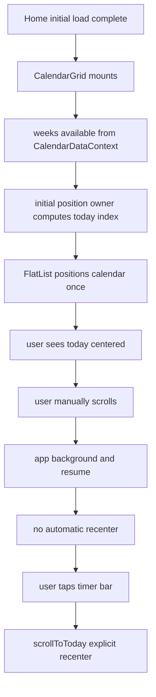
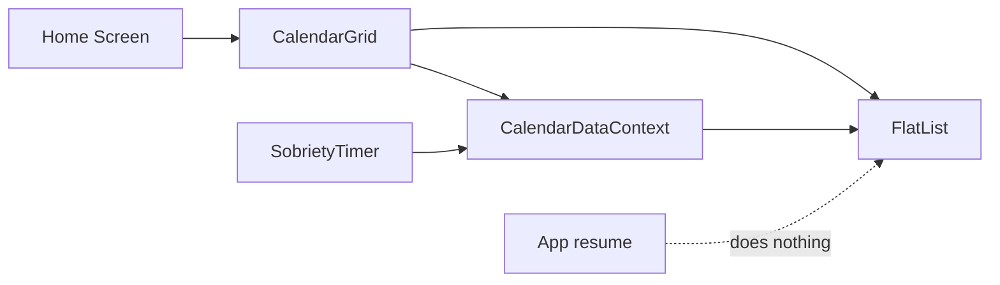

## Stabilize Calendar Launch Scroll and Resume Behavior

<!--
- THIS IS YOUR SOURCE OF TRUTH.
- USE IT TO TAKE ANY NOTES YOU MAY FIND HELPFUL.
- AS YOU COMPLETE THE TASK, UPDATE THIS CHECKLIST TO REFLECT PROGRESS. (- [x] for done, - [ ] for pending)
-->

### Executive Summary

#### What's broken?

Cold launch uses multiple competing scroll-to-today paths, so the calendar can visibly jump before settling.

#### What's the fix?

Make one component own initial positioning, keep manual recenter on timer tap, and preserve passive viewport behavior on background resume.

#### What happens after the fix?

- Returning user with no history: calendar opens once with today centered and no jump.
- Returning user with long history: calendar opens once with today centered and no blank space caused by bad offset math.
- User resuming after manual scroll: app keeps the last viewport until the user taps the black timer bar.

#### What changes?

- `app/(app)/(protected)/index.tsx`: stops orchestrating delayed startup scroll timers.
- `components/ui/calendar/CalendarGrid.tsx`: becomes the single owner of initial calendar positioning.
- `context/CalendarDataContext.tsx`: keeps `scrollToToday()` as explicit user-triggered recenter behavior.
- `components/ui/timer/__tests__/SobrietyTimer.interaction.test.tsx`: stays the reference pattern for explicit recenter intent.

#### What's the risk?

If initial-position ownership is moved incorrectly, today may fail to center, infinite scroll may regress, or timer recenter may stop working. Fallback plan: keep manual timer recenter intact and gate new initial-position logic behind a one-time guard.

#### What's on me?

Review the red/green/refactor split, keep subagents phase-pure, run the selected verification gate before any commit, and do not implement beyond this plan file in this task.

---

### Description

The calendar currently has two user-visible expectations:

1. On cold launch, the current date should appear centered in the viewport without any visible jump.
2. If the app is already running and the user manually scrolls elsewhere, backgrounding and resuming should preserve that viewport. The app should only recenter when the user explicitly taps the black sobriety timer bar.

The current code does not have one clear owner for initial positioning. `FlatList.initialScrollIndex`, `CalendarGrid` post-mount scrolling, and `Home` delayed `scrollToToday()` timers all try to control the same startup position. Separately, `getItemLayout` appears to undercount real row height, which can skew offset math and contribute to blank space below the expected position.

This task should produce an implementation plan that fixes the jump pragmatically, keeps resume behavior passive, and uses TDD with strict phase separation: one subagent for red only, one for green only, one for refactor only.

### Current vs Target State Comparison

| Scenario | Current | Target |
| --- | --- | --- |
| **User Experience** | Cold launch may show December/January, jump, then settle near today | Cold launch centers today once with no visible jump |
| **Code Structure** | Initial positioning logic split across Home, CalendarGrid, and context methods | One owner for initial positioning, one owner for explicit recenter |
| **Data Flow** | `weeks` changes and scroll effects can race during first paint | Initial position occurs after initial data is ready and is guarded to run once |
| **Performance** | Redundant scroll work and avoidable list repositioning on startup | Single startup positioning path with fewer scroll operations |
| **Dependencies** | Existing React Native/FlatList behavior plus calendar context | No new dependency required |
| **Error Handling** | Scroll failures handled reactively; startup sequence still noisy | Startup scroll path is deterministic, with failure fallback localized |

### Acceptance Criteria

- [ ] Cold launch renders the home screen and centers today's week exactly once without a second automatic scroll triggered by `app/(app)/(protected)/index.tsx`.
- [ ] Backgrounding and resuming after manual calendar scrolling preserves the previously visible viewport and does not call `scrollToToday()` automatically.
- [ ] Tapping the black sobriety timer bar still calls `scrollToToday()` and recenters today's week.
- [ ] Initial-position code has a single clear owner and no duplicate startup timers remain in `app/(app)/(protected)/index.tsx`.
- [ ] `getItemLayout` math matches the rendered week row height closely enough that the list does not leave obvious blank future space below the centered target state.
- [ ] New or updated tests fail in red, pass in green, and still pass after refactor.

### User Story

As a sober user opening the app, I want the calendar to open calmly on today and stay where I left it after backgrounding so that the calendar feels predictable and only recenters when I ask it to.

Critical acceptance criteria:

- [ ] Cold launch reaches the centered-today state without a visible second reposition.
- [ ] Resume from background preserves the manually chosen viewport until the user taps the timer bar.

### Gherkin BDD Scenarios

```md
### Scenario: Cold launch centers today without jump

Given the app is cold launched to the home screen
And the user may have no history, some history, or long history
When the calendar first becomes visible
Then today's week is centered in the viewport
And the app does not perform a second automatic recenter after the initial position is applied

Acceptance Criteria:

- The startup path uses one initial-position owner
- No delayed Home-level startup timer triggers a second scroll
```

### Scenario: Background resume preserves manually selected viewport

```md
Given the app is already running on the home screen
And the user has manually scrolled to a different part of the calendar
When the app moves to the background and later returns to the foreground
Then the calendar keeps the previously visible viewport
And the app does not automatically snap back to today

Acceptance Criteria:

- No foreground lifecycle hook calls `scrollToToday()` automatically
- Tapping the black sobriety timer bar is still the explicit recenter action
```

### Scope & Boundaries

#### In Scope

- [ ] Remove duplicate startup scroll ownership.
- [ ] Define one idiomatic initial-position path for `CalendarGrid`.
- [ ] Preserve current passive resume behavior.
- [ ] Keep explicit timer-bar recenter behavior.
- [ ] Add or update tests in red/green/refactor order.
- [ ] Verify list layout math used by `getItemLayout`.

#### Out of Scope

- Reworking overall calendar design or virtualization strategy.
- Changing the intended centered-today UX.
- Adding new app lifecycle behavior on resume.
- Fixing unrelated onboarding prop-type warnings.
- Broad repository cleanup unrelated to calendar launch behavior.

### Codebase Orientation

- Entry points:
  - `app/(app)/(protected)/index.tsx`
  - `components/ui/calendar/CalendarGrid.tsx`
  - `context/CalendarDataContext.tsx`
- Key patterns to follow:
  - Explicit user-driven recenter in `components/ui/timer/SobrietyTimer.tsx`
  - Context-managed calendar ref and `scrollToToday()` in `context/CalendarDataContext.tsx`
  - Existing interaction tests in `components/ui/timer/__tests__/SobrietyTimer.interaction.test.tsx`
- Where to find examples:
  - Calendar list and scroll fallback logic in `components/ui/calendar/CalendarGrid.tsx`
  - Manual recenter action in `components/ui/timer/SobrietyTimer.tsx`
- Dev commands:
  - `npm test -- --runInBand`
  - `npm test -- CalendarGrid`
  - `npm test -- SobrietyTimer.interaction`

### Dependencies

- Existing React Native `FlatList` behavior with `initialScrollIndex`, `scrollToIndex`, and `getItemLayout`
- Existing `CalendarDataContext` state and `calendarRef`
- Existing Jest and React Native Testing Library setup
- Existing timer interaction behavior in `SobrietyTimer`

### Data Flow



### Data Models

#### InitialCalendarPositionState

Tracks whether startup positioning has already been applied for the mounted screen lifetime.

```ts
type InitialCalendarPositionState = {
  hasAppliedInitialPosition: boolean;
  initialTodayIndex: number;
};
```

#### WeekLayoutMetrics

Captures the row-height contract used by `getItemLayout`.

```ts
type WeekLayoutMetrics = {
  rowHeight: number;
  rowSpacing: number;
  itemLength: number;
};
```

#### ResumeBehaviorContract

Documents the intended passive resume behavior.

```ts
type ResumeBehaviorContract = {
  autoRecenterOnForeground: false;
  explicitRecenterSource: 'sobriety-timer-tap';
};
```

### Architecture Diagram



### Architecture Decision Records

1. **Single startup owner**: Current startup positioning is fragmented across screen mount timers and list-level positioning. Options: keep Home as owner, make context own it, or make `CalendarGrid` own it. Decision: prefer `CalendarGrid` because it owns `FlatList`, knows render timing, and can localize initial-position state without pushing view concerns into the screen or shared context. Consequence: startup behavior becomes easier to reason about; secondary effect is reduced coupling between Home and internal calendar list timing.

2. **Resume stays passive**: Options: add `AppState`-driven restoration, add explicit offset persistence, or keep the existing passive/native preservation model. Decision: keep resume passive because the desired UX is "stay where I left it" and current code already does that by not intervening. Consequence: less lifecycle complexity; secondary effect is reliance on mounted-view preservation rather than new storage or lifecycle code.

3. **Manual recenter remains explicit**: Options: auto-recenter on multiple lifecycle events or keep one explicit recenter control. Decision: preserve timer-bar tap as the only explicit recenter action. Consequence: predictable UX and lower accidental motion; secondary effect is tests can assert one clear intent path.

4. **Layout contract must be explicit**: Options: keep hardcoded `67`, remove `getItemLayout`, or centralize measured constants that reflect actual week height. Decision: keep `getItemLayout` but align it with the real rendered item contract. Consequence: better positioning stability without abandoning virtualization; secondary effect is styling changes must update the shared layout constant.

### Resources and References

- `app/(app)/(protected)/index.tsx`
- `components/ui/calendar/CalendarGrid.tsx`
- `components/ui/calendar/DayCell.tsx`
- `components/ui/calendar/utils.ts`
- `context/CalendarDataContext.tsx`
- `components/ui/timer/SobrietyTimer.tsx`
- `components/ui/timer/__tests__/SobrietyTimer.interaction.test.tsx`
- `config/supabase.ts`

### Deliverables

- `app/(app)/(protected)/index.tsx`
- `components/ui/calendar/CalendarGrid.tsx`
- `context/CalendarDataContext.tsx`
- `components/ui/calendar/__tests__/CalendarGrid.initial-position.test.tsx` or nearest existing calendar test file
- `components/ui/timer/__tests__/SobrietyTimer.interaction.test.tsx` if assertion updates are needed
- Optional task notes inside this `plan.md`

### Error Handling

#### Error Scenarios

1. **Scenario 1:** `scrollToIndex` fails because list items are not yet measurable.

   - **Handling:** Use the existing localized `onScrollToIndexFailed` fallback inside `CalendarGrid`; keep retries inside the single owner only.
   - **User Impact:** Calendar still settles to today without a visible multi-owner fight.

2. **Scenario 2:** `getItemLayout` constants drift from rendered styling again.

   - **Handling:** Centralize row metrics and reference them in both styling assumptions and `getItemLayout` math.
   - **User Impact:** Reduced chance of blank space or off-center settling after future style changes.

---

### 🧩 Implementation Checklist (Step-by-Step To-Do)

#### Phase 1: Implementation Tasks

**Phase 1: Red - Prove the bug with failing tests only (2-3 hours)**

**Subagent rule:** Assign exactly one subagent to this phase. That subagent may only add or update failing tests and test helpers. It must not modify production behavior.

**Task 1.1: Define failing cold-launch behavior**

- [ ] RESEARCH: Inspect existing calendar and timer test setup in `components/ui/calendar` and `components/ui/timer/__tests__`
- [ ] CREATE: Add a cold-launch test file in `components/ui/calendar/__tests__/` that documents the intended one-time initial-centering behavior
- [ ] VERIFY: Assert that startup does not trigger duplicate automatic recenter calls from the Home screen path
- [ ] NOTE: Mirror interaction style from `components/ui/timer/__tests__/SobrietyTimer.interaction.test.tsx`

Relevant sketch:

```ts
it('centers today once on cold launch without a second automatic recenter', async () => {
  render(<Home />);

  await waitFor(() => {
    expect(mockInitialPositionOwner).toHaveBeenCalledTimes(1);
  });

  expect(mockScrollToToday).not.toHaveBeenCalledTimes(2);
});
```

**Task 1.2: Define failing resume-preservation behavior**

- [ ] CREATE: Add or update a test covering manual scroll away + background resume in `components/ui/calendar/__tests__/` or a home-screen integration test file
- [ ] VERIFY: Assert that foreground/resume does not trigger `scrollToToday()` automatically
- [ ] VERIFY: Assert that timer-bar tap still triggers explicit recenter
- [ ] NOTE: Keep resume test focused on behavior contract, not implementation details

Relevant sketch:

```ts
it('preserves viewport on resume until the timer bar is tapped', async () => {
  render(<Home />);

  simulateManualCalendarScrollAway();
  simulateAppResume();

  expect(mockScrollToToday).not.toHaveBeenCalled();

  fireEvent.press(screen.getByText(/sober/i));
  expect(mockScrollToToday).toHaveBeenCalledTimes(1);
});
```

**Task 1.3: Lock down layout contract with a failing expectation**

- [ ] CREATE: Add a focused test for `getItemLayout` math in `components/ui/calendar/__tests__/CalendarGrid.initial-position.test.tsx`
- [ ] VERIFY: Assert that the exported or centralized row metric matches the rendered week spacing contract
- [ ] NOTE: If the component does not expose metrics yet, red should define the desired public constant or helper signature only in tests

Relevant sketch:

```ts
expect(getWeekItemLayout(undefined, 10)).toEqual({
  index: 10,
  length: WEEK_ITEM_LENGTH,
  offset: WEEK_ITEM_LENGTH * 10,
});
```

**Implementation notes:** The red subagent should return only failing tests, new mocks/helpers, exact failure output, and a short note listing production files it intentionally did not touch.

**Phase 2: Green - Make the smallest production change to pass red (2-4 hours)**

**Subagent rule:** Assign exactly one subagent to this phase. That subagent may only make the minimal production and test adjustments needed to pass the red tests. It must not do cleanup beyond what is required for passing behavior.

**Anti-cheat rule:** The green subagent must not weaken, bypass, delete, or redefine the red-phase test expectations just to make them pass. If a red test is exposing the real bug, fix production code instead of editing the assertion to be easier. Only update a test in green when the red test itself is objectively incorrect, and if that happens the subagent must explain exactly why the original test was invalid.

**Task 2.1: Remove duplicate Home-level startup scroll ownership**

- [ ] UPDATE: Remove delayed startup `scrollToToday()` timers from `app/(app)/(protected)/index.tsx`
- [ ] KEEP: Preserve loading gates and existing screen composition in `app/(app)/(protected)/index.tsx`
- [ ] VERIFY: Home no longer owns initial calendar positioning
- [ ] VERIFY: Do not alter the red test's core behavioral assertions to hide duplicate startup scrolling
- [ ] NOTE: Do not change explicit timer-bar recenter behavior

Before/after sketch:

```tsx
// Before
useEffect(() => {
  if (!isLoadingInitial && !initialScrollDoneRef.current) {
    setTimeout(() => scrollToToday(), 300);
    setTimeout(() => scrollToToday(), 800);
  }
}, [isLoadingInitial, scrollToToday]);

// After
useEffect(() => {
  // Home waits for initial data only.
  // CalendarGrid owns initial positioning.
}, [isLoadingInitial]);
```

**Task 2.2: Make `CalendarGrid` the only initial-position owner**

- [ ] UPDATE: Consolidate one-time initial positioning inside `components/ui/calendar/CalendarGrid.tsx`
- [ ] IMPLEMENT: Guard initial positioning with a local one-time ref or equivalent mounted-lifetime state
- [ ] IMPLEMENT: Prevent duplicate startup scrolls when `weeks` changes after first render
- [ ] NOTE: Keep `scrollToToday()` available for explicit user recenter only

Relevant sketch:

```tsx
const hasAppliedInitialPositionRef = useRef(false);

useEffect(() => {
  if (hasAppliedInitialPositionRef.current) return;
  if (!calendarRef.current) return;
  if (initialTodayIndex < 0) return;

  hasAppliedInitialPositionRef.current = true;
  calendarRef.current.scrollToIndex({
    index: initialTodayIndex,
    animated: false,
    viewPosition: 0.5,
  });
}, [initialTodayIndex, calendarRef]);
```

**Task 2.3: Align `getItemLayout` with actual week row metrics**

- [ ] UPDATE: Extract row metrics into a constant or helper in `components/ui/calendar/CalendarGrid.tsx` or a nearby utility
- [ ] IMPLEMENT: Use the shared metric in `getItemLayout`
- [ ] VERIFY: The metric accounts for row height plus vertical spacing used by the rendered week row
- [ ] NOTE: Mirror actual styles used by `DayCell` and the week-row wrapper

Relevant sketch:

```ts
export const WEEK_ROW_HEIGHT = 67;
export const WEEK_ROW_MARGIN_BOTTOM = 4;
export const WEEK_ITEM_LENGTH = WEEK_ROW_HEIGHT + WEEK_ROW_MARGIN_BOTTOM;

const getWeekItemLayout = (_: unknown, index: number) => ({
  length: WEEK_ITEM_LENGTH,
  offset: WEEK_ITEM_LENGTH * index,
  index,
});
```

**Task 2.4: Preserve passive resume behavior explicitly by omission**

- [ ] VERIFY: Do not add `AppState` listeners or focus hooks for recentering
- [ ] VERIFY: Do not persist manual scroll offset as part of this fix
- [ ] NOTE: This is intentional because the target behavior is "stay where I left it"

**Implementation notes:** The green subagent should return only the minimal passing diff, tests run, any assumptions still left rough for refactor, and an explicit statement confirming it did not make a cheating test edit.

**Phase 3: Refactor - Clarify contracts and reduce future drift (1-2 hours)**

**Subagent rule:** Assign exactly one subagent to this phase. That subagent may only improve clarity, names, constants, and local structure after green is passing. It must not introduce new behavior or add new scope.

**Task 3.1: Extract scroll-position contract names**

- [ ] REFACTOR: Rename ambiguous startup-scroll refs/flags in `components/ui/calendar/CalendarGrid.tsx`
- [ ] REFACTOR: Clarify any context names in `context/CalendarDataContext.tsx` if they still imply startup ownership
- [ ] NOTE: Prefer names like `hasAppliedInitialPosition` over vague names like `initialScrollDone`

**Task 3.2: Isolate week layout constants**

- [ ] REFACTOR: Move week item metrics to one obvious constant block or helper
- [ ] REFACTOR: Add a small non-obvious comment only if the row-height math would otherwise be fragile
- [ ] VERIFY: Styling and `getItemLayout` read from the same contract source where practical

**Task 3.3: Tighten test readability without changing behavior**

- [ ] REFACTOR: Remove duplicated test setup between calendar startup and resume tests
- [ ] REFACTOR: Extract helper builders for mock calendar context if repeated more than twice
- [ ] VERIFY: Tests still describe user behavior first, implementation second

**Implementation notes:** The refactor subagent should return only no-behavior-change cleanup, final passing test output, and a short list of invariants preserved.

#### Phase 2: Commit Changes

Once implementation and your manual device verification are complete, commit the work using the repo's normal commit conventions.

- [ ] **Create Commit**: Attempt the commit after implementation and your manual device verification are complete
- [ ] **Handle Hook Failures**: If commit hooks fail, inspect the output, fix the issues, and retry the commit

**NOTE**: Do not bypass commit hooks. Treat hook failures as feedback that must be resolved before the task is considered complete.

### Manual QA Checklist

- [ ] Cold launch the app on iOS simulator with sparse history and confirm today appears centered without a visible jump.
- [ ] Cold launch the app on iOS simulator with long history and confirm no blank future gap appears below the settled state.
- [ ] Manually scroll far into past or future, background the app, resume it, and confirm the viewport stays put.
- [ ] Tap the black sobriety timer bar and confirm the calendar recenters on today.
- [ ] Confirm no unrelated onboarding warning work was mixed into this task.
