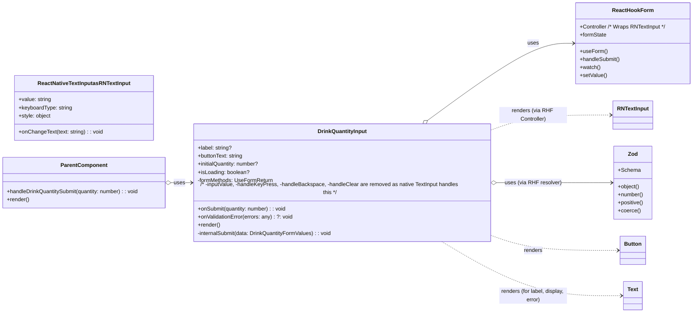

# Architectural Proposal: DrinkQuantityInput Component

## Problem Statement
The task is to design the architecture for a reusable React Native component, `DrinkQuantityInput.tsx`. This component will allow users to input a numeric quantity of drinks using a keypad interface. It must validate that the input is a positive integer, provide visual feedback based on input validity, and trigger a callback function upon submission.

A key requirement is reusability: the component will be used in the onboarding flow (with "Next" as button text and navigation as the post-submission action) and potentially in an editing context (e.g., with "Save" as button text and a different post-submission action). The design must accommodate these variations by allowing the parent component to customize button text and handle the submission logic.

The component should align with visual mockups (_ai/ui/onboarding/4.jpg, _ai/ui/onboarding/5.jpg) and behavioral requirements defined in Gherkin scenarios ([`bdd-drink-quantity-input.md`](bdd-drink-quantity-input.md:0)).

## Proposed Solution: Controlled Component with Externalized Actions

The `DrinkQuantityInput` component will be designed as a controlled component, primarily managed by React Hook Form for its internal state (input value) and Zod for validation. It will expose a clear props interface to allow parent components to provide initial values, customize UI elements like the label and button text, and, crucially, handle the submission event.

### 1. Props Interface (`DrinkQuantityInputProps`)

```typescript
import { Control } from 'react-hook-form';

export interface DrinkQuantityFormValues {
  quantity: number;
}

export interface DrinkQuantityInputProps {
  /**
   * The main label or question text to display above the input area.
   * e.g., "How many drinks per week?"
   */
  label?: string;

  /**
   * The text to display on the submit button.
   * e.g., "Next", "Save"
   */
  buttonText: string;

  /**
   * Callback function triggered when the form is submitted with a valid quantity.
   * Receives the validated numeric quantity.
   */
  onSubmit: (quantity: number) => void;

  /**
   * Optional initial quantity to pre-fill the input.
   * Defaults to 0 if not provided.
   */
  initialQuantity?: number;

  /**
   * Optional callback to inform the parent about validation errors.
   * This can be used for more complex error display logic if needed,
   * though basic visual cues will be handled internally.
   */
  onValidationError?: (errors: any) => void; // Consider a more specific error type

  /**
   * Optional flag to indicate if the component is currently in a loading state
   * (e.g., parent is processing submission). This can be used to disable the
   * submit button or show a loading indicator.
   */
  isLoading?: boolean;
}
```

### 2. Zod Validation Schema

The validation schema will ensure that the input quantity is a positive number. React Hook Form will use this schema via its Zod resolver.

```typescript
import { z } from 'zod';

export const DrinkQuantitySchema = z.object({
  quantity: z.coerce // Use coerce to convert string input from keypad to number
    .number({
      invalid_type_error: 'Please enter a number.',
      required_error: 'Quantity is required.',
    })
    .positive({ message: 'Please enter a quantity greater than 0.' })
    // Consider adding a reasonable upper limit if applicable, e.g., .max(1000)
});
```

### 3. Internal State Management (React Hook Form)

- **React Hook Form (`useForm`)**: Will be used to manage the form state, including the input value for `quantity`.
    - `control`: The `control` object from `useForm` will be passed to RHF's `<Controller>` component, which will wrap the standard React Native `TextInput`.
    - `handleSubmit`: RHF's `handleSubmit` will wrap our `onSubmit` prop, ensuring validation runs before `onSubmit` is called.
    - `formState: { errors, isValid }`:
        - `errors`: Used to display validation messages (e.g., "Please enter a quantity greater than 0").
        - `isValid`: Used to enable/disable the submit button.
    - `watch`: To observe the `quantity` value for updating the large numeric display and potentially for custom clear logic.
    - `setValue`: To programmatically update the form value, for instance, if a custom "clear" button is implemented to set the quantity to "0".
    - `defaultValues`: The `initialQuantity` prop will be used to set the `defaultValues.quantity`.
    - The `TextInput`'s `onChangeText` will be handled by the RHF `<Controller>` to update the form state, and its `value` will be supplied by the `<Controller>`.

### 4. Handling Button Text and Submission Logic

- **`buttonText` Prop**: Directly controls the text of the submit button (e.g., [`Button`](components/ui/button.tsx:0) component).
- **`onSubmit` Prop (Callback)**: This is the core of the reusability strategy.
    - The `DrinkQuantityInput` component's responsibility ends after validating the input and calling `this.props.onSubmit(validatedQuantity)`.
    - The parent component implements the `onSubmit` callback and decides what action to take (e.g., navigate to the next onboarding screen, call an API to save data, dismiss a modal). This decouples the `DrinkQuantityInput` from specific application workflows.

### 5. Displaying Validation Errors

- **Visual Cues**:
    - The submit button's disabled state (controlled by `formState.isValid` from RHF and the `isLoading` prop) provides an immediate visual cue.
    - The mockups show a large numeric display. If an error occurs (e.g., "Please enter a quantity greater than 0"), this message can be displayed below the numeric input or near the submit button using a [`Text`](components/ui/text.tsx:0) component. The visibility of this error message will be tied to `formState.errors.quantity`.
- **`onValidationError` Prop (Optional)**: If more sophisticated error handling is needed by the parent (e.g., logging, displaying errors in a global notification system), this callback can provide the error details. For most cases, internal display should suffice.

### 6. Input Handling (Native Keyboard)

- The component will use a standard React Native `TextInput` component, configured with `keyboardType='number-pad'` to present a numeric-only keyboard to the user.
- This `TextInput` will be wrapped by React Hook Form's `<Controller>` component, which handles the synchronization of the input's value with the form state.
- User input (digits) will be directly entered into the `TextInput`.
- Backspace functionality is provided natively by the keyboard associated with the `TextInput`.
- To achieve the large centered number display shown in the mockups:
    - Option A (Preferred for simplicity): The `TextInput` itself can be styled (font size, text alignment, no border/underline if needed) to appear as the large display.
    - Option B: A separate `<Text>` component can display the formatted value watched from React Hook Form, while the actual `TextInput` might be hidden or minimally styled. This adds slight complexity but offers more styling flexibility for the display if needed.
- A "clear" action (e.g., if a user wants to quickly reset to "0") can be implemented via a custom button that calls `setValue('quantity', 0)` (or an appropriate string value that Zod coerces to 0, like `"0"`). The Gherkin scenarios indicate "0" as the cleared/initial state.
- The `quantity` value in the RHF state will be a string from the `TextInput`, which Zod's `coerce.number()` will convert to a number for validation and submission.

## UML Diagram (Component Structure)



## Architecture Decision Record (ADR)

-   **Context**:
    We need a reusable component (`DrinkQuantityInput.tsx`) for users to input a numeric drink quantity. This input must be validated (positive numbers only). The component must be adaptable for different scenarios (e.g., onboarding vs. editing), specifically allowing customization of the submit button's text and the action performed upon successful submission. The component should integrate with React Hook Form for state management and Zod for validation, aligning with the project's tech stack.

-   **Decision**:
    1.  **Props-Driven Configuration**: The component will accept `buttonText` (string) and `onSubmit` (function) props. `buttonText` will define the label of the submission button. `onSubmit` will be a callback function invoked with the validated numeric quantity, allowing the parent component to define the subsequent action (e.g., navigation, API call).
    2.  **Input Method**: A standard React Native `TextInput` component, configured with `keyboardType='number-pad'`, will be used for numeric input. This leverages the native device keyboard.
    3.  **State Management**: React Hook Form (`useForm`) will manage the input's state. The `TextInput` will be wrapped with RHF's `<Controller>` component for seamless integration. RHF's `handleSubmit` will manage the validation flow, and `formState` (e.g., `isValid`, `errors`) will drive UI updates (e.g., button disable/enable, error messages).
    4.  **Validation**: Zod will be used to define the validation schema (`DrinkQuantitySchema`), requiring a positive number. This schema will be integrated with React Hook Form via its Zod resolver. `z.coerce.number()` is crucial for converting the `TextInput`'s string value to a number for validation.
    5.  **Error Display**: Basic validation errors (e.g., "Please enter a quantity greater than 0") will be displayed directly within the component, using information from `formState.errors`. An optional `onValidationError` prop can be added for more complex parent-driven error handling if needed.
    6.  **Optional Props**: `label` (string) for a title/question, `initialQuantity` (number) to pre-fill the input, and `isLoading` (boolean) to indicate a loading state controlled by the parent.

-   **Consequences**:
    -   **Pros**:
        -   **High Reusability**: The `onSubmit` callback and `buttonText` prop provide excellent flexibility.
        -   **Clear Separation of Concerns**: `DrinkQuantityInput` focuses on input and validation; the parent handles post-submission actions.
        -   **Testability**: Logic is testable via props and RHF utilities.
        -   **Leverages Existing Stack**: Uses RHF and Zod effectively.
        -   **Reduced Custom Code**: Utilizes native `TextInput` for keyboard input, reducing custom UI development and maintenance for a keypad.
        -   **Native Look & Feel**: Input interaction uses the device's native numeric keypad.
        -   **Maintainability**: Code is modular and follows established patterns.
    -   **Cons**:
        -   The parent component remains responsible for implementing the actual submission logic (by design).
        -   Styling the `TextInput` to perfectly match the large display in mockups might require careful attention, but is generally achievable.
    -   **Risks**:
        -   Minimal. Ensuring consistent appearance of the styled `TextInput` across platforms is a common React Native consideration.

## Recommended Solution
The proposed solution using a controlled component approach with React Hook Form, Zod, and props for `buttonText` and `onSubmit` is recommended. It directly addresses the reusability challenge, aligns with best practices for component design, and integrates well with the specified tech stack.

## TDD Phase Guidance

### Red Phase (Writing Failing Tests)
1.  **Test `DrinkQuantityInputProps` contract**:
    *   Test that the component renders the `label` if provided.
    *   Test that the component renders the `buttonText` on the submit button.
    *   Test that the submit button is initially disabled (as per Gherkin Scenario 1 & 3).
    *   Test that if `initialQuantity` is provided and is valid, the input displays it and the button is enabled.
    *   Test that if `initialQuantity` is provided and is `0` or invalid, the button is disabled.
2.  **Test Input and Validation Behavior (based on Gherkin scenarios)**:
    *   Test entering "0" (or clearing) keeps/makes the button disabled and displays "0".
    *   Test entering a valid positive number (e.g., "7") enables the button and updates the display.
    *   Test that attempting to submit with "0" (button disabled) does not call `onSubmit`.
    *   Test that submitting a valid positive number calls `onSubmit` with the correct numeric value.
    *   Test that Zod validation for positive numbers works with `TextInput` (string value) being coerced:
        *   Simulate `TextInput` `onChangeText` with "0", "", or a string that coerces to a non-positive number. Ensure an error message (e.g., "Please enter a quantity greater than 0") is displayed and `onSubmit` is not called.
3.  **Test `isLoading` prop**:
    *   Test that if `isLoading` is true, the submit button is disabled, even if the input is valid.
4.  **Test `onValidationError` prop (if implemented)**:
    *   Test that `onValidationError` is called with error details when validation fails.

### Green Phase (Minimal Implementation)
1.  Implement the basic component structure with a RHF `<Controller>` wrapping a React Native `TextInput` (styled for large display or with a separate `<Text>` display), a [`Text`](components/ui/text.tsx:0) for the label, and a [`Button`](components/ui/button.tsx:0).
2.  Configure `TextInput` with `keyboardType='number-pad'`.
3.  Integrate `useForm` from React Hook Form with the Zod schema (`DrinkQuantitySchema`).
4.  The RHF `<Controller>` will link `TextInput`'s `onChangeText` and `value` to the form state.
5.  Use `formState.isValid` and `isLoading` prop to control button's `disabled` state.
6.  Display `formState.errors.quantity.message` when an error exists.
7.  Call `props.onSubmit` via RHF's `handleSubmit`.

### Refactor Phase
1.  Refine styling of the `TextInput` (or separate display `<Text>`) to match mockups (Nativewind).
2.  Ensure error message display is clear and well-positioned.
3.  Verify accessibility of the input.
4.  Ensure all props are handled correctly and defaults are sensible.
5.  Check for any potential code smells.